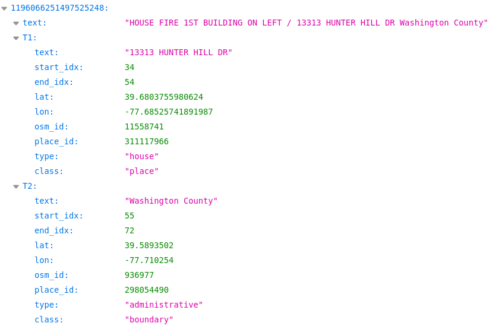

# Introduction

Welcome to the DLRGeoTweet project! This repository contains the dataset for the paper "DLRGeoTweet: A Comprehensive Social Media Geocoding Corpus Featuring Fine-Grained Places." The dataset includes five sub-datasets with approximately 7,000 tweets and 12,000 places from around the world, encompassing 6,000 fine-grained locations.

The screenshot of the corpus is as follows:
<p align="center">
 
</p>


Please note that the ID for some tweets is missing. In these cases, we have synthesized an ID, such as '200000002'.

In our paper, we categorize places into six groups based on the OSM type and class features using [category.py](category.py), although this categorization might not be entirely accurate. You are welcome to define your own categories using the OSM type and class features.

To access the full dataset, please fill out [this form](https://docs.google.com/forms/d/e/1FAIpQLSd7m2F1Hw7CAir0r2WkfItOROlVwhasQNMwQTKTPXbCgzjD0w/viewform?usp=sf_link). Alternatively, you can download a subset containing 250 tweets from [this folder](https://drive.google.com/drive/folders/1nMDdxGi8qB-Q-JXt4NvOuNSjkb4YGEcg?usp=sharing).

# Citation

If you use DLRGeoTweet, please cite the following publication:

```bibtex
@article{hu2024dlrgeotweet,
  title={DLRGeoTweet: A comprehensive social media geocoding corpus featuring fine-grained places},
  author={Hu, Xuke and El{\ss}ner, Tobias and Zheng, Shiyu and Serere, Helen Ngonidzashe and Kersten, Jens and Klan, Friederike and Qiu, Qinjun},
  journal={Information Processing \& Management},
  volume={61},
  number={4},
  pages={103742},
  year={2024},
  publisher={Elsevier}
}
```
# Contact
xuke.hu@dlr.de or xuke.hu1386@gmail.com


